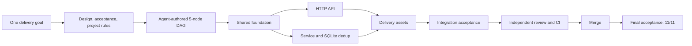

# Webhook Inbox

[](https://github.com/xiaohei-info/oh-my-multica-demo-webhook-inbox/actions/workflows/ci.yml)
[](https://github.com/xiaohei-info/oh-my-multica)

[English](README.md) | [简体中文](README.zh-CN.md)

This repository contains a Webhook Inbox delivered end to end by
[oh-my-multica](https://github.com/xiaohei-info/oh-my-multica) through real Multica work items, Coding Agent
runtimes, public Pull Requests, independent review, and final acceptance.

<p align="center">
  
</p>

## Requirement

Build a small service that third-party systems can send signed webhook events to. The service must verify the
HMAC-SHA256 signature against the exact request body before parsing JSON, store every valid event in SQLite, and
remain correct when senders retry an event or deliver it concurrently.

The same event ID and body must never create a second record. Reusing an event ID with different content must be
rejected without changing the original event. The service must also support event lookup and database health
checks, enforce a 1 MiB body limit, return stable JSON errors, avoid logging secrets or complete payloads, and
ship with reproducible dependencies, CI, and a non-root container.

The full input is checked in as [`GOAL.md`](GOAL.md).

## How the Agents collaborated



Planner and Orchestrator Agents inspected the repository, defined acceptance, and dynamically planned a five-node
delivery DAG. Worker Agents implemented the bounded nodes, with independent tracks running in parallel when their
dependencies allowed it. Reviewer Agents reran each node's declared checks before merge, and the Acceptor Agent
tested the integrated default branch from the HTTP boundary. The deterministic Loop controlled ready-node
calculation, evidence gates, merge eligibility, and the final stop decision.

Planning, orchestration, and acceptance used `codex-ubuntu`. Three cost-efficient `newapi` runtimes handled the
implementation workload, while separate Reviewer runtimes provided independent quality judgment.

| Node | Responsibility | Public delivery |
| --- | --- | --- |
| Shared foundation | Domain types, configuration, errors, quality baseline | [PR #2](https://github.com/xiaohei-info/oh-my-multica-demo-webhook-inbox/pull/2) |
| HTTP API | Bounded body reads, headers, stable HTTP errors, health endpoint | [PR #3](https://github.com/xiaohei-info/oh-my-multica-demo-webhook-inbox/pull/3) |
| Persistence and dedup | Verify-before-parse service flow and transaction-safe SQLite deduplication | [PR #4](https://github.com/xiaohei-info/oh-my-multica-demo-webhook-inbox/pull/4) |
| Delivery assets | Hashed dependencies, CI matrix, Docker image, operator docs | [PR #5](https://github.com/xiaohei-info/oh-my-multica-demo-webhook-inbox/pull/5) |
| Integration acceptance | Full-path acceptance harness and integrated service verification | [PR #6](https://github.com/xiaohei-info/oh-my-multica-demo-webhook-inbox/pull/6) |

## Delivered behavior

| Scenario | Service result |
| --- | --- |
| A new event has a valid ID, signature, and JSON body | Store it atomically and return `201` |
| The same ID and exact body are delivered again | Return `200` with `"duplicate": true`; keep one database row |
| The same ID is reused with different content | Return `409`; keep the original event unchanged |
| The signature is missing or invalid | Return `401`; persist nothing |
| The request body is larger than 1 MiB | Return `413`; persist nothing |
| A caller requests a stored or unknown event | Return the parsed event with `200`, or `404` |
| A caller checks service and database health | Return `200` when healthy, or `503` when the database is unavailable |

The result is a runnable FastAPI and SQLite service with transaction-safe deduplication under sequential and
concurrent delivery. It runs as UID 1001 in Docker, persists its database under `/data`, and exposes a container
healthcheck.

## Delivery evidence

| Evidence | Result |
| --- | --- |
| Delivery DAG | 5/5 nodes converged to `done` |
| Pull requests | 5 reviewed PRs merged |
| Test suite | 86 tests passed |
| Coverage | 97.18%, above the 90% gate |
| CI | Python 3.10, 3.11, 3.12, and 3.13 passed |
| Container delivery | Non-root image, healthcheck, signed-webhook smoke test passed |
| Final acceptance | 11/11 flows passed on the integrated `main` branch |
| Controller result | exit 0 |

The delivery facts are checked in as the [manifest DAG](.omac/webhook-inbox.yaml),
[acceptance document](.omac/webhook-inbox.acceptance.yaml), and [delivery goal](GOAL.md).

## Reproduce the evidence

Requires Python 3.10+, OpenSSL, and Docker for the container checks.

### Local setup

```bash
python3 -m venv .venv
.venv/bin/python -m pip install --require-hashes -r requirements.txt
```

### Tests

```bash
bash tests/acceptance.sh
bash tests/verify_delivery.sh
```

`tests/acceptance.sh` starts the real `compose:app` service in isolated
temporary environments and covers all 11 approved flows, including concurrent
same-ID delivery and persistence across restart. Each flow has bounded startup
checks and guaranteed process/file cleanup.

The normal quality gates are also available:

```bash
.venv/bin/python -m pytest --cov=src --cov-report=term-missing --cov-fail-under=90 tests/
.venv/bin/ruff check src tests
.venv/bin/ruff format --check src tests
.venv/bin/python -m mypy src
```

## Service

### Architecture

```text
HTTP request
    │
    ▼
FastAPI boundary (src/api.py)
    │  bounded raw-body read, headers, stable error mapping
    ▼
Service (src/service.py)
    │  constant-time HMAC, verify before JSON parse
    ▼
Repository (src/repository.py)
       SQLite primary-key dedup, exact-byte comparison, WAL
```

The application is composed in [`compose.py`](compose.py). Framework code owns
HTTP concerns, service code owns authentication and parsing order, and the
repository owns the deduplication transaction.

### Endpoints

| Method | Path | Success | Main failures |
| --- | --- | --- | --- |
| `POST` | `/webhooks` | `201` new / `200` duplicate | `400`, `401`, `409`, `413` |
| `GET` | `/events/{event_id}` | `200` | `404` |
| `GET` | `/health` | `200` | `503` |

### Run locally

```bash
WEBHOOK_SECRET=changeme DATABASE_PATH=./inbox.db \
  .venv/bin/python -m uvicorn compose:app --host 127.0.0.1 --port 8000
```

### Environment variables

| Variable | Required | Default | Purpose |
| --- | --- | --- | --- |
| `WEBHOOK_SECRET` | Yes | — | HMAC key used to verify `X-Webhook-Signature` |
| `DATABASE_PATH` | No | `./webhook_inbox.db` | SQLite database path |

### Docker

```bash
docker build -t webhook-inbox .
docker run --rm -p 127.0.0.1:8000:8000 \
  -e WEBHOOK_SECRET=changeme \
  -v webhook-inbox-data:/data \
  webhook-inbox
```

The image runs as UID 1001, persists SQLite data under `/data`, and reports
container health through `GET /health`.

### Signed webhook example

```bash
SECRET="changeme"
BODY='{"type":"invoice.paid","amount":42}'
SIG="$(printf '%s' "$BODY" | openssl dgst -sha256 -hmac "$SECRET" -hex | sed 's/^.* //')"

curl -sS -X POST http://127.0.0.1:8000/webhooks \
  -H "Content-Type: application/json" \
  -H "X-Event-ID: evt-$(date +%s)" \
  -H "X-Webhook-Signature: sha256=$SIG" \
  --data-binary "$BODY"
```

Replaying the exact event ID and raw body returns `200` with
`"duplicate": true`. Reusing the ID with different bytes returns `409`.

## Production constraints implemented

- HMAC comparison is constant time, and signature verification happens before
  JSON parsing.
- The 1 MiB body limit is enforced on raw bytes before persistence.
- SQLite uniqueness and transactions are the deduplication authority; no
  process-local mutex is required.
- Missing secrets fail startup. Secrets, signature headers, and full payloads
  are not logged.
- Dependencies are pinned with hashes. CI covers Python 3.10 through 3.13.
- The Docker image runs as UID 1001 and has a container healthcheck.

## About oh-my-multica

[oh-my-multica](https://github.com/xiaohei-info/oh-my-multica) is a software
delivery control layer built on Multica. Agents still design, plan, implement,
review, and accept work. Deterministic software owns dependency scheduling,
evidence gates, bounded rework, merge conditions, recovery, and the final stop
decision.

Read the [oh-my-multica README](https://github.com/xiaohei-info/oh-my-multica#readme) for the delivery model behind
this project.

## License

[MIT](LICENSE)
