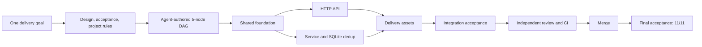

# Webhook Inbox

[](https://github.com/xiaohei-info/oh-my-multica-demo-webhook-inbox/actions/workflows/ci.yml)
[](https://github.com/xiaohei-info/oh-my-multica)

[English](README.md) | [简体中文](README.zh-CN.md)

This repository is the real end-to-end delivery demo for
[oh-my-multica](https://github.com/xiaohei-info/oh-my-multica). It started with
one requirement: build a small webhook service with production constraints,
then keep going until the change had passed design, implementation, CI,
independent review, merge, and final acceptance.

The result is a FastAPI and SQLite service that verifies HMAC-SHA256
signatures, stores exact request bytes atomically, handles duplicate deliveries
without an in-memory lock, ships as a non-root container, and has a checked-in
acceptance harness.

This is not the mock demo from the main project. The work ran through Multica
with real Coding Agent runtimes and real pull requests.

## Result at a glance

| Evidence | Result |
| --- | --- |
| Delivery DAG | 5/5 nodes converged to `done` |
| Pull requests | 5 reviewed PRs merged; one early foundation PR was superseded |
| Test suite | 86 tests passed |
| Coverage | 97.18%, above the 90% gate |
| CI | Python 3.10, 3.11, 3.12, and 3.13 passed |
| Container delivery | Non-root image, healthcheck, signed-webhook smoke test passed |
| Final acceptance | 11/11 flows passed on the integrated `main` branch |
| Controller result | exit 0 |

The delivery artifacts are checked in. Read the
[manifest DAG](.omac/webhook-inbox.yaml), the
[acceptance document](.omac/webhook-inbox.acceptance.yaml), and the
[delivery goal](GOAL.md) without relying on an Agent summary.

## What oh-my-multica coordinated



The implementation work was split by architectural boundary, not by a fixed
demo script:

| Node | Responsibility | Public delivery |
| --- | --- | --- |
| Shared foundation | Domain types, configuration, errors, quality baseline | [PR #2](https://github.com/xiaohei-info/oh-my-multica-demo-webhook-inbox/pull/2) |
| HTTP API | Bounded body reads, headers, stable HTTP errors, health endpoint | [PR #3](https://github.com/xiaohei-info/oh-my-multica-demo-webhook-inbox/pull/3) |
| Persistence and dedup | Verify-before-parse service flow and transaction-safe SQLite deduplication | [PR #4](https://github.com/xiaohei-info/oh-my-multica-demo-webhook-inbox/pull/4) |
| Delivery assets | Hashed dependencies, CI matrix, Docker image, operator docs | [PR #5](https://github.com/xiaohei-info/oh-my-multica-demo-webhook-inbox/pull/5) |
| Integration acceptance | Full-path harness and the final cross-track fix | [PR #6](https://github.com/xiaohei-info/oh-my-multica-demo-webhook-inbox/pull/6) |

Workers produced the changes. Separate reviewer Agents reran the declared
verification commands before merge. A final acceptor then tested the integrated
default branch from the user-facing HTTP boundary.

## The failure that made this demo useful

The first final-acceptance round did not pass.

The production service and checked-in harness used `compose:app`, but the
reviewed acceptance document still started the intentionally minimal
`src.api:app` stub. The acceptor did not reuse the worker's successful test
claim. It ran the document literally and recorded 2 passing flows and 9 failed
flows.

The acceptance source was corrected in commit
[`56daf00`](https://github.com/xiaohei-info/oh-my-multica-demo-webhook-inbox/commit/56daf007c2cd6fc1b25c03e22ad4e957d18ea2a3).
The full acceptance document was then rerun from the beginning. All 11 flows
passed, and the controller returned exit 0.

That failure is the point of the demo. Code generation had already finished.
The delivery loop still found that the evidence source and the production entry
point disagreed, refused to call the project complete, preserved the failed
round, and reran acceptance after the source was repaired.

## Reproduce the evidence

Requires Python 3.10+, OpenSSL, and Docker for the container checks.

```bash
python3 -m venv .venv
.venv/bin/python -m pip install --require-hashes -r requirements.txt

bash tests/acceptance.sh
bash tests/verify_delivery.sh
```

`tests/acceptance.sh` starts the real `compose:app` service in isolated
temporary environments and covers all 11 approved flows, including concurrent
same-ID delivery and persistence across restart. Each flow has bounded startup
checks and guaranteed process/file cleanup.

The normal quality gates are also available:

```bash
.venv/bin/python -m pytest --cov=src --cov-report=term-missing --cov-fail-under=90 tests/
.venv/bin/ruff check src tests
.venv/bin/ruff format --check src tests
.venv/bin/python -m mypy src
```

## Service architecture

```text
HTTP request
    │
    ▼
FastAPI boundary (src/api.py)
    │  bounded raw-body read, headers, stable error mapping
    ▼
Service (src/service.py)
    │  constant-time HMAC, verify before JSON parse
    ▼
Repository (src/repository.py)
       SQLite primary-key dedup, exact-byte comparison, WAL
```

The application is composed in [`compose.py`](compose.py). Framework code owns
HTTP concerns, service code owns authentication and parsing order, and the
repository owns the deduplication transaction.

### Endpoints

| Method | Path | Success | Main failures |
| --- | --- | --- | --- |
| `POST` | `/webhooks` | `201` new / `200` duplicate | `400`, `401`, `409`, `413` |
| `GET` | `/events/{event_id}` | `200` | `404` |
| `GET` | `/health` | `200` | `503` |

### Run locally

```bash
WEBHOOK_SECRET=changeme DATABASE_PATH=./inbox.db \
  .venv/bin/python -m uvicorn compose:app --host 127.0.0.1 --port 8000
```

Send a signed webhook:

```bash
SECRET="changeme"
BODY='{"type":"invoice.paid","amount":42}'
SIG="$(printf '%s' "$BODY" | openssl dgst -sha256 -hmac "$SECRET" -hex | sed 's/^.* //')"

curl -sS -X POST http://127.0.0.1:8000/webhooks \
  -H "Content-Type: application/json" \
  -H "X-Event-ID: evt-$(date +%s)" \
  -H "X-Webhook-Signature: sha256=$SIG" \
  --data-binary "$BODY"
```

Replaying the exact event ID and raw body returns `200` with
`"duplicate": true`. Reusing the ID with different bytes returns `409`.

## Production constraints implemented

- HMAC comparison is constant time, and signature verification happens before
  JSON parsing.
- The 1 MiB body limit is enforced on raw bytes before persistence.
- SQLite uniqueness and transactions are the deduplication authority; no
  process-local mutex is required.
- Missing secrets fail startup. Secrets, signature headers, and full payloads
  are not logged.
- Dependencies are pinned with hashes. CI covers Python 3.10 through 3.13.
- The Docker image runs as UID 1001 and has a container healthcheck.

## About oh-my-multica

[oh-my-multica](https://github.com/xiaohei-info/oh-my-multica) is a software
delivery control layer built on Multica. Agents still design, plan, implement,
review, and accept work. Deterministic software owns dependency scheduling,
evidence gates, bounded rework, merge conditions, recovery, and the final stop
decision.

Read
[Webhook Inbox: a real end-to-end delivery](https://github.com/xiaohei-info/oh-my-multica/blob/main/docs/case-studies/webhook-inbox-end-to-end.md)
for the delivery timeline, failure evidence, and model-role split.

## License

[MIT](LICENSE)
