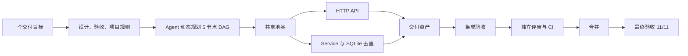

# Webhook Inbox

[](https://github.com/xiaohei-info/oh-my-multica-demo-webhook-inbox/actions/workflows/ci.yml)
[](https://github.com/xiaohei-info/oh-my-multica)

[English](README.md) | [简体中文](README.zh-CN.md)

这个仓库是 [oh-my-multica](https://github.com/xiaohei-info/oh-my-multica) 的真实端到端交付案例。
项目从一个需求开始：构建一个满足生产约束的小型 Webhook 服务，并持续推进，直到设计、开发、CI、
独立评审、合并和最终验收全部完成。

最终交付的是一个 FastAPI + SQLite 服务。它验证 HMAC-SHA256 签名，原子化保存请求原始字节，
依靠数据库约束而不是内存锁处理重复投递，以非 root 容器运行，并提供仓库内可执行的验收 Harness。

这不是主项目中的 mock demo。整个过程在 Multica 上使用真实 Coding Agent Runtime 和真实 Pull Request 完成。

## 结果概览

| 证据 | 结果 |
| --- | --- |
| 交付 DAG | 5/5 节点收敛为 `done` |
| Pull Request | 5 个经过评审的 PR 合并；1 个早期基础实现被后续版本替代 |
| 测试 | 86 tests 通过 |
| 覆盖率 | 97.18%，高于 90% 门槛 |
| CI | Python 3.10、3.11、3.12、3.13 全部通过 |
| 容器交付 | 非 root 镜像、Healthcheck、签名 Webhook 冒烟测试通过 |
| 最终验收 | 集成后的 `main` 分支 11/11 flows 通过 |
| 控制器结果 | exit 0 |

交付控制产物都保存在仓库中。你可以直接查看
[manifest DAG](.omac/webhook-inbox.yaml)、
[验收文档](.omac/webhook-inbox.acceptance.yaml)和
[交付目标](GOAL.md)，不需要相信 Agent 的文字总结。

## oh-my-multica 做了什么



实现任务按真实架构边界拆分，不是套用固定 demo 脚本：

| 节点 | 职责 | 公开交付证据 |
| --- | --- | --- |
| 共享地基 | 领域类型、配置、错误模型、质量基线 | [PR #2](https://github.com/xiaohei-info/oh-my-multica-demo-webhook-inbox/pull/2) |
| HTTP API | 有界读取、请求头、稳定错误响应、健康检查 | [PR #3](https://github.com/xiaohei-info/oh-my-multica-demo-webhook-inbox/pull/3) |
| 持久化与去重 | 先验签后解析、事务安全的 SQLite 去重 | [PR #4](https://github.com/xiaohei-info/oh-my-multica-demo-webhook-inbox/pull/4) |
| 交付资产 | Hash 固定依赖、CI 矩阵、Docker 镜像、运维文档 | [PR #5](https://github.com/xiaohei-info/oh-my-multica-demo-webhook-inbox/pull/5) |
| 集成验收 | 全链路 Harness 与跨 Track 最终修复 | [PR #6](https://github.com/xiaohei-info/oh-my-multica-demo-webhook-inbox/pull/6) |

Worker 负责产出改动，独立 Reviewer 在合并前重新执行合同中声明的验证命令。最后由 Acceptor 从
用户可见的 HTTP 边界验收集成后的默认分支。

## 这个案例最有价值的一次失败

第一轮最终验收没有通过。

生产服务和仓库内 Harness 使用 `compose:app`，但经过评审的验收文档仍然启动了刻意保留的最小
`src.api:app` Stub。Acceptor 没有复用 Worker 的成功测试结论，而是严格执行验收文档，记录了
2 个 flow 通过、9 个 flow 失败。

验收源在 commit
[`56daf00`](https://github.com/xiaohei-info/oh-my-multica-demo-webhook-inbox/commit/56daf007c2cd6fc1b25c03e22ad4e957d18ea2a3)
中完成修正。随后系统从头重跑完整验收文档，11 个 flow 全部通过，控制器返回 exit 0。

这次失败正是案例的意义。代码生成当时已经结束，但交付 Loop 仍然发现证据来源与生产入口不一致，
拒绝把项目标记为完成，保留失败轮次，并在修正验收源后重新执行最终验收。

## 复现证据

需要 Python 3.10+、OpenSSL；容器检查还需要 Docker。

### 本地环境

```bash
python3 -m venv .venv
.venv/bin/python -m pip install --require-hashes -r requirements.txt
```

### 测试

```bash
bash tests/acceptance.sh
bash tests/verify_delivery.sh
```

`tests/acceptance.sh` 会在隔离的临时环境中启动真实 `compose:app`，覆盖全部 11 个验收 flow，
包括同 ID 并发投递和服务重启后的持久化行为。每个 flow 都有有界启动检查，并保证清理进程和临时文件。

常规质量门也可以单独执行：

```bash
.venv/bin/python -m pytest --cov=src --cov-report=term-missing --cov-fail-under=90 tests/
.venv/bin/ruff check src tests
.venv/bin/ruff format --check src tests
.venv/bin/python -m mypy src
```

## 服务

### 架构

```text
HTTP 请求
    │
    ▼
FastAPI 边界（src/api.py）
    │  原始 Body 有界读取、Header 提取、稳定错误映射
    ▼
Service（src/service.py）
    │  常量时间 HMAC、先验签后解析 JSON
    ▼
Repository（src/repository.py）
       SQLite 主键去重、原始字节比较、WAL
```

应用在 [`compose.py`](compose.py) 中完成组装。Framework 层只处理 HTTP，Service 层负责认证和解析顺序，
Repository 层拥有去重事务。

### API

| 方法 | 路径 | 成功 | 主要失败状态 |
| --- | --- | --- | --- |
| `POST` | `/webhooks` | 新事件 `201` / 重复事件 `200` | `400`、`401`、`409`、`413` |
| `GET` | `/events/{event_id}` | `200` | `404` |
| `GET` | `/health` | `200` | `503` |

### 本地运行

```bash
WEBHOOK_SECRET=changeme DATABASE_PATH=./inbox.db \
  .venv/bin/python -m uvicorn compose:app --host 127.0.0.1 --port 8000
```

### 环境变量

| 变量 | 必填 | 默认值 | 用途 |
| --- | --- | --- | --- |
| `WEBHOOK_SECRET` | 是 | — | 用于验证 `X-Webhook-Signature` 的 HMAC 密钥 |
| `DATABASE_PATH` | 否 | `./webhook_inbox.db` | SQLite 数据库路径 |

### Docker

```bash
docker build -t webhook-inbox .
docker run --rm -p 127.0.0.1:8000:8000 \
  -e WEBHOOK_SECRET=changeme \
  -v webhook-inbox-data:/data \
  webhook-inbox
```

镜像以 UID 1001 运行，将 SQLite 数据保存在 `/data`，并通过 `GET /health` 报告容器健康状态。

### 签名 Webhook 示例

```bash
SECRET="changeme"
BODY='{"type":"invoice.paid","amount":42}'
SIG="$(printf '%s' "$BODY" | openssl dgst -sha256 -hmac "$SECRET" -hex | sed 's/^.* //')"

curl -sS -X POST http://127.0.0.1:8000/webhooks \
  -H "Content-Type: application/json" \
  -H "X-Event-ID: evt-$(date +%s)" \
  -H "X-Webhook-Signature: sha256=$SIG" \
  --data-binary "$BODY"
```

使用相同事件 ID 和原始 Body 重放会返回 `200` 与 `"duplicate": true`；使用相同 ID 但不同字节会返回 `409`。

## 已实现的生产约束

- 使用常量时间 HMAC 比较，并在 JSON 解析前完成签名验证。
- 在持久化前按原始字节执行 1 MiB Body 限制。
- SQLite 唯一约束与事务是去重权威，不依赖进程内 Mutex。
- 缺少密钥时启动失败；日志不记录密钥、签名 Header 或完整 Payload。
- 依赖使用 Hash 固定；CI 覆盖 Python 3.10 至 3.13。
- Docker 镜像使用 UID 1001 运行，并包含容器 Healthcheck。

## 关于 oh-my-multica

[oh-my-multica](https://github.com/xiaohei-info/oh-my-multica) 是构建在 Multica 之上的软件交付控制层。
Agent 仍然负责设计、规划、开发、评审和验收；确定性程序负责依赖调度、证据门、有界返工、合并条件、
恢复和最终停止判断。

阅读[《Webhook Inbox：一次真实的端到端交付》](https://github.com/xiaohei-info/oh-my-multica/blob/main/docs/case-studies/webhook-inbox-end-to-end.zh-CN.md)，
查看完整交付时间线、失败证据和模型角色分工。

## License

[MIT](LICENSE)
