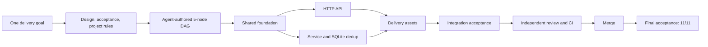

# Webhook Inbox

[](https://github.com/xiaohei-info/oh-my-multica-demo-webhook-inbox/actions/workflows/ci.yml)
[](https://github.com/xiaohei-info/oh-my-multica)

[English](README.md) | [简体中文](README.zh-CN.md)

这个仓库包含一个由 [oh-my-multica](https://github.com/xiaohei-info/oh-my-multica) 完整交付的 Webhook
Inbox。整个过程使用真实的 Multica 工作项、Coding Agent Runtime、公开 Pull Request、独立评审和最终验收。

## 输入需求

构建一个小型服务，用于接收第三方系统发送的签名 Webhook 事件。服务必须在解析 JSON 前，使用请求
原始 Body 验证 HMAC-SHA256 签名；合法事件保存到 SQLite；发送方重试或并发投递时，服务仍然只能
保存一条事件记录。

同一事件 ID 和原始 Body 再次投递时不能生成新记录；同一事件 ID 携带不同内容时必须拒绝，并保持
原事件不变。服务还需要提供事件查询和数据库健康检查，限制 1 MiB 请求体，返回稳定的 JSON 错误，
不记录密钥或完整 Payload，并提供可复现依赖、CI 和非 root 容器。

完整输入保存在 [`GOAL.md`](GOAL.md) 中。

## Agent 如何协作



Planner 和 Orchestrator Agent 检查仓库、定义验收标准，并动态规划出五节点交付 DAG。Worker Agent 在
任务边界内完成实现，依赖允许时并行开发；Reviewer Agent 在合并前独立复跑每个节点声明的检查；
Acceptor Agent 从 HTTP 边界验收集成后的默认分支。确定性交付 Loop 负责计算 ready nodes、检查证据、
判断合并资格和最终停止条件。

规划、编排和验收使用 `codex-ubuntu`；三个高性价比 `newapi` Runtime 承担主要实现工作；独立 Reviewer
Runtime 负责质量判断。

| 节点 | 职责 | 公开交付证据 |
| --- | --- | --- |
| 共享地基 | 领域类型、配置、错误模型、质量基线 | [PR #2](https://github.com/xiaohei-info/oh-my-multica-demo-webhook-inbox/pull/2) |
| HTTP API | 有界读取、请求头、稳定错误响应、健康检查 | [PR #3](https://github.com/xiaohei-info/oh-my-multica-demo-webhook-inbox/pull/3) |
| 持久化与去重 | 先验签后解析、事务安全的 SQLite 去重 | [PR #4](https://github.com/xiaohei-info/oh-my-multica-demo-webhook-inbox/pull/4) |
| 交付资产 | Hash 固定依赖、CI 矩阵、Docker 镜像、运维文档 | [PR #5](https://github.com/xiaohei-info/oh-my-multica-demo-webhook-inbox/pull/5) |
| 集成验收 | 全链路验收 Harness 与集成服务验证 | [PR #6](https://github.com/xiaohei-info/oh-my-multica-demo-webhook-inbox/pull/6) |

## 最终业务效果

| 场景 | 服务结果 |
| --- | --- |
| 使用合法 ID、签名和 JSON Body 投递新事件 | 原子化保存并返回 `201` |
| 再次投递相同 ID 和原始 Body | 返回 `200` 和 `"duplicate": true`，数据库仍只有一条记录 |
| 使用相同 ID 投递不同内容 | 返回 `409`，原事件保持不变 |
| 缺少签名或签名错误 | 返回 `401`，不写入数据 |
| 请求 Body 超过 1 MiB | 返回 `413`，不写入数据 |
| 查询已保存或不存在的事件 | 返回解析后的事件与 `200`，或返回 `404` |
| 检查服务和数据库健康状态 | 健康时返回 `200`，数据库不可用时返回 `503` |

最终得到一个可运行的 FastAPI + SQLite 服务。它能在顺序重试和并发投递下执行事务安全去重，以
UID 1001 在 Docker 中运行，把数据库持久化到 `/data`，并提供容器 Healthcheck。

## 交付证据

| 证据 | 结果 |
| --- | --- |
| 交付 DAG | 5/5 节点收敛为 `done` |
| Pull Request | 5 个经过评审的 PR 合并 |
| 测试 | 86 tests 通过 |
| 覆盖率 | 97.18%，高于 90% 门槛 |
| CI | Python 3.10、3.11、3.12、3.13 全部通过 |
| 容器交付 | 非 root 镜像、Healthcheck、签名 Webhook 冒烟测试通过 |
| 最终验收 | 集成后的 `main` 分支 11/11 flows 通过 |
| 控制器结果 | exit 0 |

交付事实保存在 [manifest DAG](.omac/webhook-inbox.yaml)、
[验收文档](.omac/webhook-inbox.acceptance.yaml)和[交付目标](GOAL.md)中。

## 复现证据

需要 Python 3.10+、OpenSSL；容器检查还需要 Docker。

### 本地环境

```bash
python3 -m venv .venv
.venv/bin/python -m pip install --require-hashes -r requirements.txt
```

### 测试

```bash
bash tests/acceptance.sh
bash tests/verify_delivery.sh
```

`tests/acceptance.sh` 会在隔离的临时环境中启动真实 `compose:app`，覆盖全部 11 个验收 flow，
包括同 ID 并发投递和服务重启后的持久化行为。每个 flow 都有有界启动检查，并保证清理进程和临时文件。

常规质量门也可以单独执行：

```bash
.venv/bin/python -m pytest --cov=src --cov-report=term-missing --cov-fail-under=90 tests/
.venv/bin/ruff check src tests
.venv/bin/ruff format --check src tests
.venv/bin/python -m mypy src
```

## 服务

### 架构

```text
HTTP 请求
    │
    ▼
FastAPI 边界（src/api.py）
    │  原始 Body 有界读取、Header 提取、稳定错误映射
    ▼
Service（src/service.py）
    │  常量时间 HMAC、先验签后解析 JSON
    ▼
Repository（src/repository.py）
       SQLite 主键去重、原始字节比较、WAL
```

应用在 [`compose.py`](compose.py) 中完成组装。Framework 层只处理 HTTP，Service 层负责认证和解析顺序，
Repository 层拥有去重事务。

### API

| 方法 | 路径 | 成功 | 主要失败状态 |
| --- | --- | --- | --- |
| `POST` | `/webhooks` | 新事件 `201` / 重复事件 `200` | `400`、`401`、`409`、`413` |
| `GET` | `/events/{event_id}` | `200` | `404` |
| `GET` | `/health` | `200` | `503` |

### 本地运行

```bash
WEBHOOK_SECRET=changeme DATABASE_PATH=./inbox.db \
  .venv/bin/python -m uvicorn compose:app --host 127.0.0.1 --port 8000
```

### 环境变量

| 变量 | 必填 | 默认值 | 用途 |
| --- | --- | --- | --- |
| `WEBHOOK_SECRET` | 是 | — | 用于验证 `X-Webhook-Signature` 的 HMAC 密钥 |
| `DATABASE_PATH` | 否 | `./webhook_inbox.db` | SQLite 数据库路径 |

### Docker

```bash
docker build -t webhook-inbox .
docker run --rm -p 127.0.0.1:8000:8000 \
  -e WEBHOOK_SECRET=changeme \
  -v webhook-inbox-data:/data \
  webhook-inbox
```

镜像以 UID 1001 运行，将 SQLite 数据保存在 `/data`，并通过 `GET /health` 报告容器健康状态。

### 签名 Webhook 示例

```bash
SECRET="changeme"
BODY='{"type":"invoice.paid","amount":42}'
SIG="$(printf '%s' "$BODY" | openssl dgst -sha256 -hmac "$SECRET" -hex | sed 's/^.* //')"

curl -sS -X POST http://127.0.0.1:8000/webhooks \
  -H "Content-Type: application/json" \
  -H "X-Event-ID: evt-$(date +%s)" \
  -H "X-Webhook-Signature: sha256=$SIG" \
  --data-binary "$BODY"
```

使用相同事件 ID 和原始 Body 重放会返回 `200` 与 `"duplicate": true`；使用相同 ID 但不同字节会返回 `409`。

## 已实现的生产约束

- 使用常量时间 HMAC 比较，并在 JSON 解析前完成签名验证。
- 在持久化前按原始字节执行 1 MiB Body 限制。
- SQLite 唯一约束与事务是去重权威，不依赖进程内 Mutex。
- 缺少密钥时启动失败；日志不记录密钥、签名 Header 或完整 Payload。
- 依赖使用 Hash 固定；CI 覆盖 Python 3.10 至 3.13。
- Docker 镜像使用 UID 1001 运行，并包含容器 Healthcheck。

## 关于 oh-my-multica

[oh-my-multica](https://github.com/xiaohei-info/oh-my-multica) 是构建在 Multica 之上的软件交付控制层。
Agent 仍然负责设计、规划、开发、评审和验收；确定性程序负责依赖调度、证据门、有界返工、合并条件、
恢复和最终停止判断。

阅读 [oh-my-multica README](https://github.com/xiaohei-info/oh-my-multica/blob/main/README.zh-CN.md)，了解这个
项目背后的交付模型。

## License

[MIT](LICENSE)
